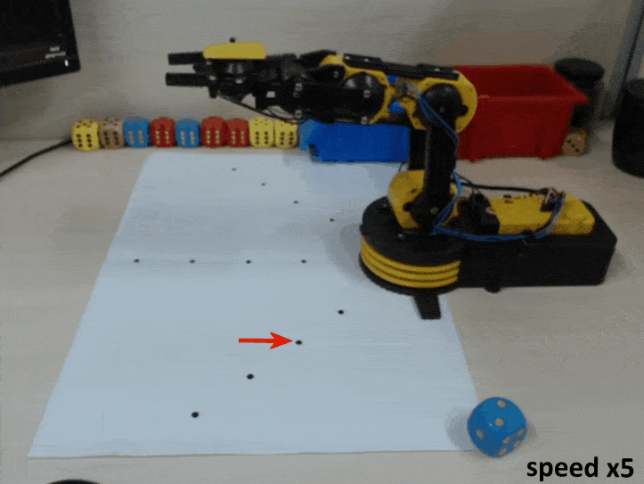

# Introduction

This repository is the control module of [CRAVES](http://unrealcv.org/). 
This repository contains hardware drivers, pose estimator, a PID-like controller, and a RL-based controller.  

## Hardware Requirement:
- USB Camera(Logitech C920)
- Robotic Arm(OWI-535)

## Software Requirement:
- Python>=2.7
- Gym
- CV2
- Matplotlib
- Numpy
- Pytorch

It is easy to install craves_control, just run
```buildoutcfg
git clone https:https://github.com/zfw1226/craves_control.git
cd craves_control
pip install -e . 
```

Note that if you want to train a new RL agent in virtual environment, ｐlease install [Gym-UnrealCV](https://github.com/zfw1226/gym-unrealcv).

# Usage
## Running A Simple Demo
Firstly, please place the camera to a position viewing the arm.
After that run the following command:
```
python craves_control/demo_control.py --kp --goal 0 0 0 0
```
The arm will move to a goal pose ``(0, 0, 0, 0)`` in a few seconds.

## Reacher
The reacher aims to move the arm to make the grip reach a expected location. 
The policy network is trained by [DDPG](https://arxiv.org/abs/1509.02971), a conventional RL algorithm for continuous action.

```
cd ddpg
python main.py --gpu-ids 0 --rescale --test --env RealArm --model-dir models/best.pt 
```
After running, the arm will automatically move to an initial position at first, 
and then reach a set of points one by one, as:


It is also robust to different viewpoint, as:
